<div align="center">

# 🎯 Платформа "Сбор"

### Микросервисная система для организации мероприятий и продажи билетов

[](https://go.dev/)
[](https://www.postgresql.org/)
[](https://kafka.apache.org/)
[](https://www.docker.com/)

---

</div>

## 📑 Содержание

- [О проекте](#-о-проекте)
- [Архитектура системы](#️-архитектура-системы)
- [Компоненты системы](#-компоненты-системы)
- [Бизнес-процессы](#-бизнес-процессы)
- [Технологический стек](#️-технологический-стек)
- [API Endpoints](#-api-endpoints)
- [Безопасность](#-безопасность)
- [Запуск проекта](#-запуск-проекта)

---

<div align="center">

## 📋 О проекте

</div>

**"Сбор"** — современная микросервисная платформа для полного цикла управления мероприятиями: от создания до продажи билетов и проверки на входе.

### ✨ Ключевые возможности

<table>
<tr>
<td width="50%">

#### 🔐 Аутентификация
- Регистрация и вход пользователей
- JWT токены (access + refresh)
- Управление ролями (user/organizer)

#### 🎫 Управление билетами
- Создание типов билетов
- Продажа билетов онлайн
- QR-коды для входа
- Валидация и check-in

</td>
<td width="50%">

#### 📅 Мероприятия
- Создание и редактирование
- Публикация и отмена
- Расписание и категории
- Автоматические напоминания

#### 📱 Уведомления
- Push-уведомления
- Email-рассылки
- Настройки пользователя
- История уведомлений

</td>
</tr>
</table>

---

<div align="center">

## 🏗️ Архитектура системы

</div>

### Общая архитектура

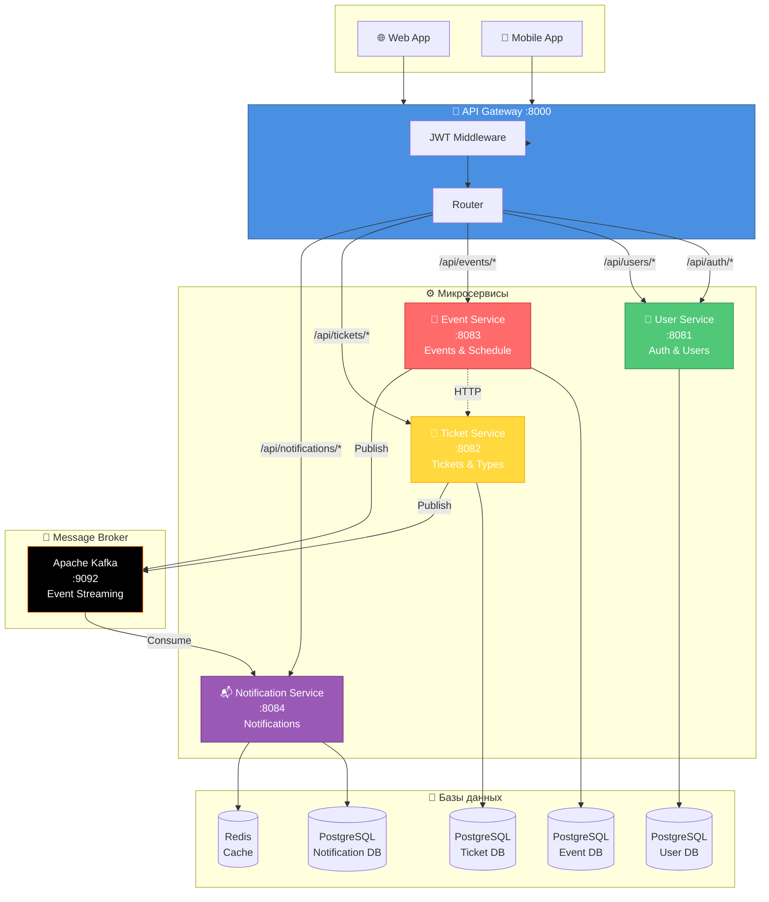

### Принципы архитектуры

<table>
<tr>
<td>

**🔒 Изоляция сервисов**
- Каждый сервис имеет свою БД
- Нет прямого доступа к чужим данным
- Независимое масштабирование

</td>
<td>

**🔄 Асинхронная коммуникация**
- Kafka для событий
- HTTP для синхронных запросов
- Event-driven архитектура

</td>
</tr>
<tr>
<td>

**🛡️ Безопасность**
- Централизованная JWT валидация
- Gateway как единая точка входа
- Изоляция сервисов

</td>
<td>

**📈 Масштабируемость**
- Горизонтальное масштабирование
- Независимое развертывание
- Микросервисная архитектура

</td>
</tr>
</table>

---

<div align="center">

## 🧩 Компоненты системы

</div>

### 🔐 API Gateway (порт 8000)

<div align="center">

| Функция | Описание |
|---------|----------|
| 🚪 **Единая точка входа** | Все запросы проходят через Gateway |
| 🔑 **JWT валидация** | Проверка токенов для защищенных эндпоинтов |
| 🧭 **Маршрутизация** | Проксирование запросов к нужным сервисам |
| 🛡️ **Безопасность** | Защита от несанкционированного доступа |

</div>

### 👤 User Service (порт 8081)

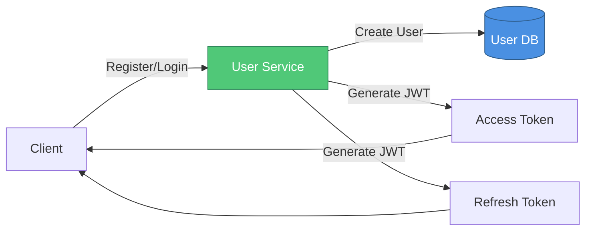

**Функции:**
- ✅ Регистрация новых пользователей
- ✅ Аутентификация (login)
- ✅ Управление профилями
- ✅ Изменение роли (user → organizer)
- ✅ Выдача JWT токенов

### 📅 Event Service (порт 8083)

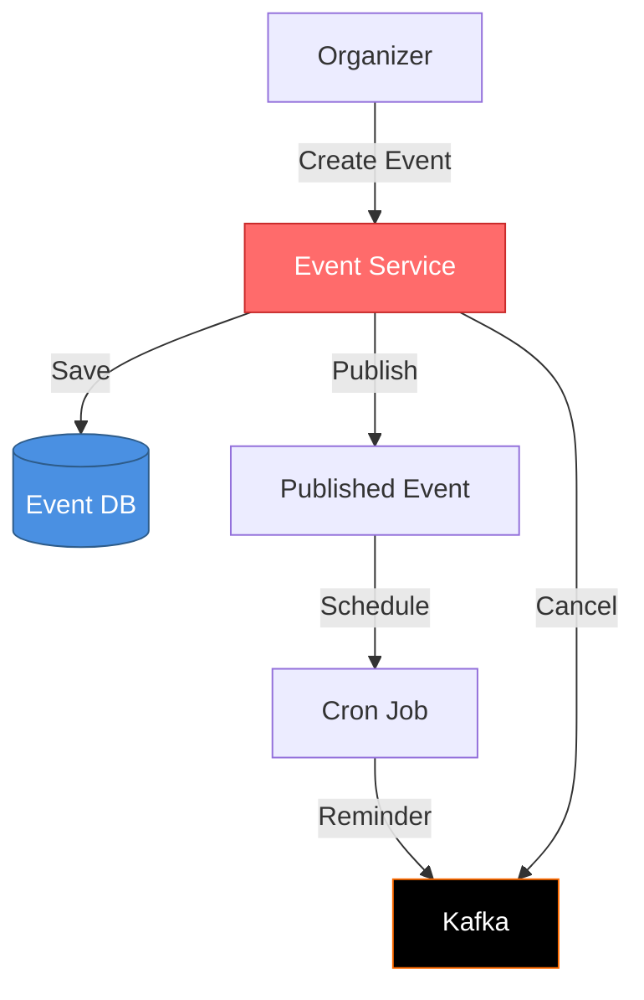

**Функции:**
- ✅ Создание мероприятий (draft → published)
- ✅ Управление категориями
- ✅ Расписание мероприятий
- ✅ Автоматические напоминания (cron)
- ✅ Публикация событий в Kafka

### 🎫 Ticket Service (порт 8082)

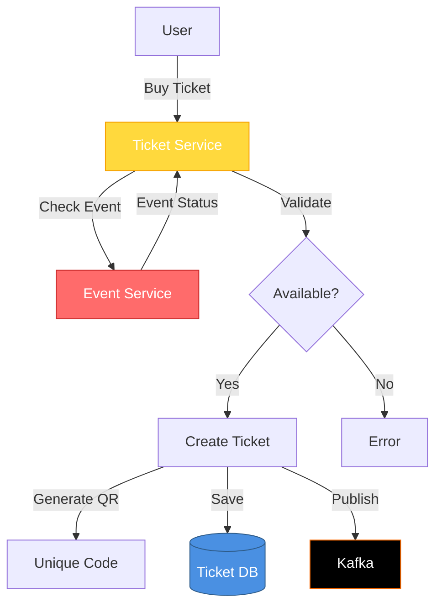

**Функции:**
- ✅ Создание типов билетов
- ✅ Продажа билетов
- ✅ Генерация QR-кодов
- ✅ Валидация билетов
- ✅ Check-in на мероприятии

### 📬 Notification Service (порт 8084)

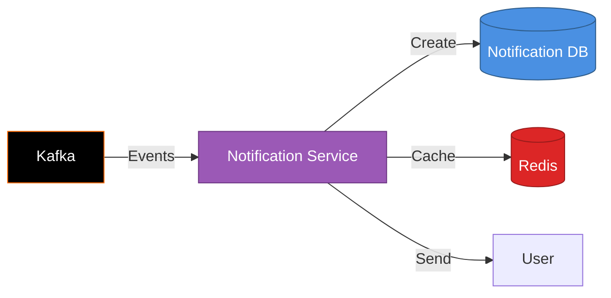

**Функции:**
- ✅ Подписка на Kafka события
- ✅ Создание уведомлений
- ✅ Кэширование в Redis
- ✅ Управление настройками
- ✅ История уведомлений

---

<div align="center">

## 🔄 Бизнес-процессы

</div>

### 1. Жизненный цикл мероприятия

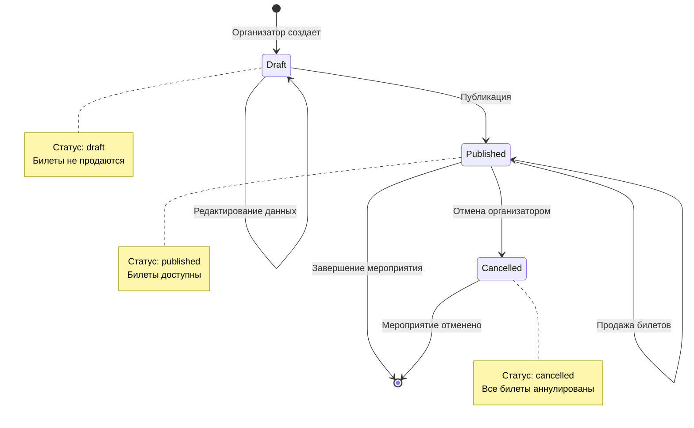

### 2. Жизненный цикл билета

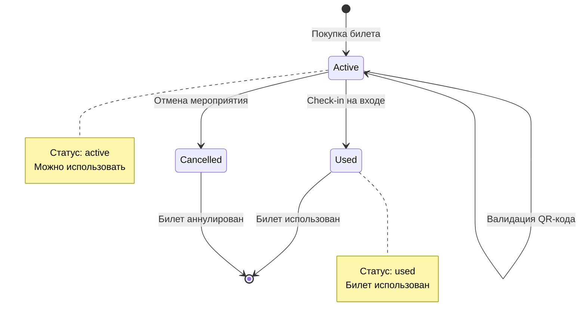

### 3. Процесс покупки билета (детальный)

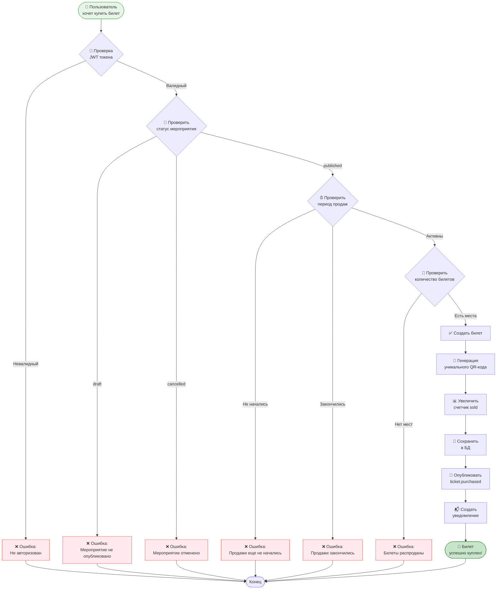

### 4. Полный цикл: от регистрации до использования билета

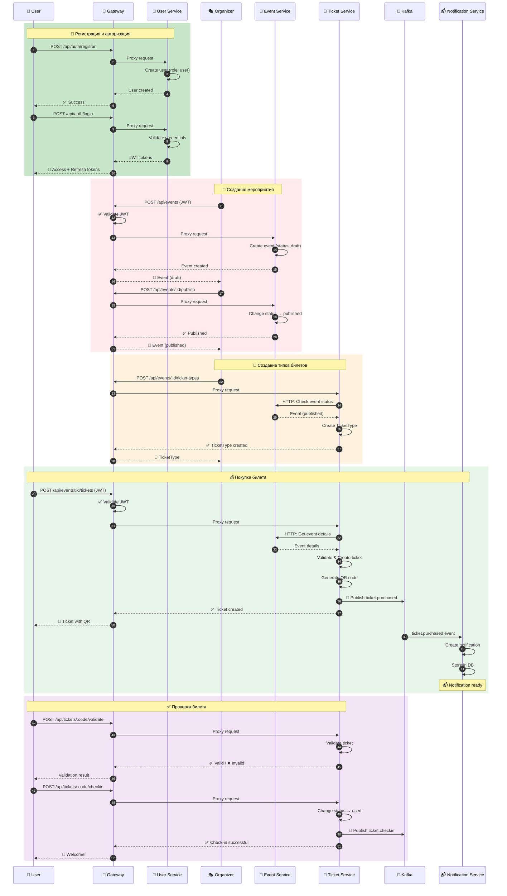

### 5. Система уведомлений (Event-Driven)

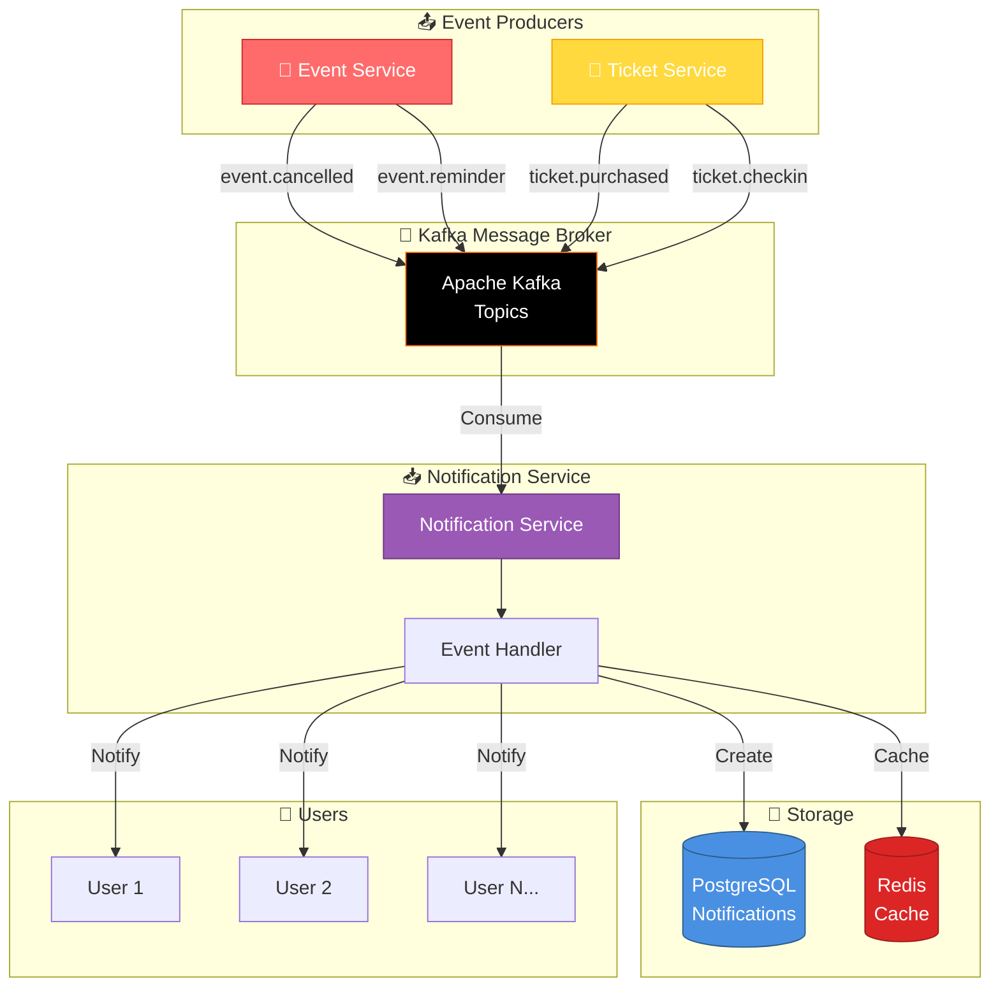

---

<div align="center">

## 🛠️ Технологический стек

</div>

### Backend

<table>
<tr>
<td width="33%">

#### 🟢 Go (Golang)
- Версия: 1.21+
- Фреймворк: Gin
- ORM: GORM
- Логирование: slog

</td>
<td width="33%">

#### 🐘 PostgreSQL
- Версия: 16
- Database per Service
- Миграции: GORM AutoMigrate
- Изоляция данных

</td>
<td width="33%">

#### 🔴 Redis
- Кэширование уведомлений
- Быстрый доступ к данным
- Session storage

</td>
</tr>
<tr>
<td>

#### 📨 Apache Kafka
- Версия: 3.7.0
- Event-driven архитектура
- Асинхронная коммуникация
- Надежная доставка

</td>
<td>

#### 🔐 JWT
- Access tokens
- Refresh tokens
- Безопасная аутентификация
- Stateless авторизация

</td>
<td>

#### 🐳 Docker
- Контейнеризация
- Docker Compose
- Изолированная среда
- Легкое развертывание

</td>
</tr>
</table>

### Архитектурные паттерны

<div align="center">

| Паттерн | Описание | Применение |
|---------|----------|------------|
| 🏗️ **Microservices** | Разделение на независимые сервисы | Все сервисы изолированы |
| 🚪 **API Gateway** | Единая точка входа | Gateway :8000 |
| 📨 **Event-Driven** | Асинхронная коммуникация через события | Kafka events |
| 💾 **Database per Service** | Каждый сервис имеет свою БД | Изоляция данных |
| 🔄 **CQRS** | Разделение чтения и записи | Оптимизация запросов |
| ⏰ **Cron Jobs** | Планировщик задач | Напоминания о мероприятиях |

</div>

---

<div align="center">

## 📡 API Endpoints

</div>

### 🔐 Gateway (порт 8000)

<div align="center">

| Метод | Путь | Назначение | Сервис |
|-------|------|------------|--------|
| `POST` | `/api/auth/*` | Аутентификация | User Service |
| `GET` | `/api/users/*` | Управление пользователями | User Service |
| `GET/POST/PUT` | `/api/events/*` | Управление мероприятиями | Event Service |
| `GET/POST` | `/api/tickets/*` | Управление билетами | Ticket Service |
| `GET` | `/api/notifications/*` | Уведомления | Notification Service |

</div>

### 👤 User Service (порт 8081)

<table>
<tr>
<td>

**Аутентификация**
- `POST /auth/register` - Регистрация
- `POST /auth/login` - Вход в систему
- `POST /auth/refresh` - Обновление токена

</td>
<td>

**Профиль**
- `GET /users/me` - Получить профиль
- `PUT /users/me` - Обновить профиль
- `POST /users/me/become-organizer` - Стать организатором

</td>
</tr>
</table>

### 📅 Event Service (порт 8083)

<table>
<tr>
<td>

**Мероприятия**
- `POST /events` - Создать мероприятие
- `GET /events` - Список мероприятий
- `GET /events/:id` - Детали мероприятия
- `PUT /events/:id` - Обновить мероприятие

</td>
<td>

**Управление**
- `POST /events/:id/publish` - Опубликовать
- `POST /events/:id/cancel` - Отменить
- `GET /events/:id/schedule` - Расписание

</td>
</tr>
</table>

### 🎫 Ticket Service (порт 8082)

<table>
<tr>
<td>

**Типы билетов**
- `POST /events/:id/ticket-types` - Создать тип
- `GET /events/:id/ticket-types` - Список типов

</td>
<td>

**Билеты**
- `POST /events/:id/tickets` - Купить билет
- `GET /tickets` - Мои билеты
- `POST /tickets/:code/validate` - Проверить
- `POST /tickets/:code/checkin` - Использовать

</td>
</tr>
</table>

### 📬 Notification Service (порт 8084)

<table>
<tr>
<td>

**Уведомления**
- `GET /notifications` - Получить список
- `GET /notifications/:id` - Детали
- `PUT /notifications/:id/read` - Отметить прочитанным

</td>
<td>

**Настройки**
- `GET /notifications/preferences` - Настройки
- `PUT /notifications/preferences` - Обновить

</td>
</tr>
</table>

---

<div align="center">

## 🔐 Безопасность

</div>

### Архитектура безопасности

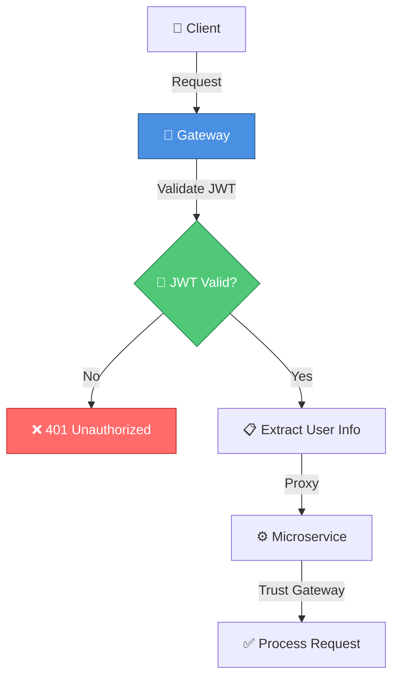

### Принципы безопасности

<div align="center">

| ✅ Принцип | 📝 Описание |
|-----------|-------------|
| **Централизованная валидация** | JWT проверяется только в Gateway |
| **Доверие между сервисами** | Сервисы доверяют Gateway |
| **Изоляция данных** | Каждый сервис имеет свою БД |
| **Нет прямого доступа** | Сервисы не лезут в чужие БД |
| **Безопасная коммуникация** | HTTP для синхронных, Kafka для асинхронных |
| **Роли и права** | user, organizer с разными правами |

</div>

### JWT Токены

<table>
<tr>
<td>

**Access Token**
- Короткий срок жизни
- Используется для запросов
- Содержит user_id, role
- Валидируется в Gateway

</td>
<td>

**Refresh Token**
- Долгий срок жизни
- Используется для обновления
- Хранится безопасно
- Обновляет access token

</td>
</tr>
</table>

---

<div align="center">

## 📈 Kafka Events

</div>

### События системы

<div align="center">

| 📨 Событие | 📤 Источник | 📥 Получатель | 📝 Описание |
|-----------|------------|--------------|-------------|
| `ticket.purchased` | 🎫 Ticket Service | 📬 Notification Service | Билет успешно куплен |
| `ticket.checkin` | 🎫 Ticket Service | 📬 Notification Service | Билет использован на входе |
| `event.cancelled` | 📅 Event Service | 📬 Notification Service | Мероприятие отменено |
| `event.reminder` | 📅 Event Service | 📬 Notification Service | Напоминание о мероприятии |

</div>

### Пример события

```json
{
  "event": "ticket.purchased",
  "timestamp": "2026-01-18T11:00:00Z",
  "data": {
    "ticket_id": "123e4567-e89b-12d3-a456-426614174000",
    "event_id": 42,
    "ticket_type_id": 3,
    "user_id": 7,
    "code": "ABCD1234",
    "status": "active",
    "purchased_at": "2026-01-18T11:00:00Z"
  }
}
```

---

<div align="center">

## 🚀 Запуск проекта

</div>

### Требования

<div align="center">

| Компонент | Версия | Назначение |
|-----------|--------|------------|
| 🐳 Docker | Latest | Контейнеризация |
| 🐳 Docker Compose | Latest | Оркестрация |
| 🟢 Go | 1.21+ | Backend разработка |
| 🐘 PostgreSQL | 16 | База данных |
| 📨 Kafka | 3.7.0 | Message broker |

</div>

### Быстрый старт

#### 1️⃣ Запуск инфраструктуры

```bash
# Запустить PostgreSQL, Kafka, Redis
docker-compose up -d

# Проверить статус
docker-compose ps
```

#### 2️⃣ Запуск сервисов

```bash
# Terminal 1: Gateway
cd gateway && go run main.go

# Terminal 2: User Service
cd user-service && go run cmd/app/main.go

# Terminal 3: Event Service
cd event-service && go run cmd/app/main.go

# Terminal 4: Ticket Service
cd ticket-service && go run cmd/app/main.go

# Terminal 5: Notification Service
cd notification-service && go run cmd/app/main.go
```

### Порты сервисов

<div align="center">

| Сервис | Порт | URL |
|--------|------|-----|
| 🔐 Gateway | 8000 | http://localhost:8000 |
| 👤 User Service | 8081 | http://localhost:8081 |
| 🎫 Ticket Service | 8082 | http://localhost:8082 |
| 📅 Event Service | 8083 | http://localhost:8083 |
| 📬 Notification Service | 8084 | http://localhost:8084 |
| 🐘 PostgreSQL | 5432 | localhost:5432 |
| 📨 Kafka | 9092 | localhost:9092 |
| 🎨 Kafka UI | 8090 | http://localhost:8090 |

</div>

---

<div align="center">

## 👥 Роли пользователей

</div>

### 👤 User (Пользователь)

<table>
<tr>
<td width="50%">

**Возможности:**
- ✅ Регистрация и авторизация
- ✅ Просмотр мероприятий
- ✅ Покупка билетов
- ✅ Просмотр своих билетов
- ✅ Получение уведомлений
- ✅ Валидация QR-кодов

</td>
<td width="50%">

**Ограничения:**
- ❌ Не может создавать мероприятия
- ❌ Не может управлять билетами
- ❌ Не может отменять события

</td>
</tr>
</table>

### 🎭 Organizer (Организатор)

<table>
<tr>
<td width="50%">

**Все возможности User +**
- ✅ Создание мероприятий
- ✅ Редактирование мероприятий
- ✅ Публикация/отмена событий
- ✅ Создание типов билетов
- ✅ Просмотр статистики

</td>
<td width="50%">

**Дополнительно:**
- ✅ Управление расписанием
- ✅ Управление категориями
- ✅ Полный контроль над событиями

</td>
</tr>
</table>

---

<div align="center">

## 🎯 Ключевые особенности

</div>

<table>
<tr>
<td width="33%">

### 📈 Масштабируемость
- Горизонтальное масштабирование
- Независимое масштабирование сервисов
- Load balancing готовность

</td>
<td width="33%">

### 🛡️ Отказоустойчивость
- Изоляция сервисов
- Нет каскадных сбоев
- Graceful degradation

</td>
<td width="33%">

### ⚡ Производительность
- Кэширование в Redis
- Асинхронная обработка
- Оптимизированные запросы

</td>
</tr>
<tr>
<td>

### 🔄 Гибкость
- Легко добавлять новые сервисы
- Независимое развертывание
- Модульная архитектура

</td>
<td>

### 🔐 Безопасность
- Централизованная аутентификация
- Изоляция данных
- JWT токены

</td>
<td>

### 📊 Мониторинг
- Structured logging
- Event tracking через Kafka
- Готовность к метрикам

</td>
</tr>
</table>

---

<div align="center">

## 📦 Структура проекта

</div>

```
general-circle/
├── 🔐 gateway/                    # API Gateway
│   ├── main.go
│   ├── proxy.go
│   ├── middleware/
│   │   └── jwt.go
│   └── jwtutil/
│       └── jwt.go
│
├── 👤 user-service/               # User Service
│   ├── cmd/app/main.go
│   ├── internal/
│   │   ├── config/
│   │   ├── models/
│   │   ├── repository/
│   │   ├── services/
│   │   └── transport/
│   └── go.mod
│
├── 📅 event-service/              # Event Service
│   ├── cmd/app/main.go
│   ├── internal/
│   │   ├── config/
│   │   ├── models/
│   │   ├── repository/
│   │   ├── services/
│   │   ├── transport/
│   │   └── kafka/
│   └── go.mod
│
├── 🎫 ticket-service/             # Ticket Service
│   ├── cmd/app/main.go
│   ├── internal/
│   │   ├── api/http/
│   │   ├── config/
│   │   ├── models/
│   │   ├── repository/
│   │   ├── services/
│   │   ├── transport/
│   │   └── kafka/
│   └── go.mod
│
├── 📬 notification-service/      # Notification Service
│   ├── cmd/app/main.go
│   ├── internal/
│   │   ├── config/
│   │   ├── models/
│   │   ├── repository/
│   │   ├── services/
│   │   ├── transport/
│   │   └── kafka/
│   └── go.mod
│
├── 🏗️ infra/                     # Инфраструктура
│   └── kafka/
│       ├── server.properties
│       └── topics.sh
│
├── 📚 docs/                       # Документация
│   └── api-contracts.md
│
├── 📄 BUSINESS_FLOWS.md           # Бизнес-процессы
├── 🐳 docker-compose.yaml         # Docker Compose
└── 📋 PRESENTATION.md             # Эта презентация
```

---

<div align="center">

## 📝 Дополнительная документация

</div>

<div align="center">

| 📄 Документ | 📝 Описание |
|------------|-------------|
| [BUSINESS_FLOWS.md](./BUSINESS_FLOWS.md) | Подробное описание всех бизнес-процессов |
| [API Контракты](./docs/api-contracts.md) | Детальные спецификации API |

</div>

---

<div align="center">

## 🎉 Заключение

**"Сбор"** — это современная, масштабируемая и надежная платформа для управления мероприятиями, построенная на принципах микросервисной архитектуры и event-driven подхода.

### Основные преимущества:
- 🚀 Быстрое развертывание
- 📈 Легкое масштабирование
- 🛡️ Высокая безопасность
- ⚡ Отличная производительность
- 🔄 Гибкая архитектура

---

*Документ создан для презентации проекта "Сбор"*  
*Версия: 1.0 | Дата: 2026*

</div>
